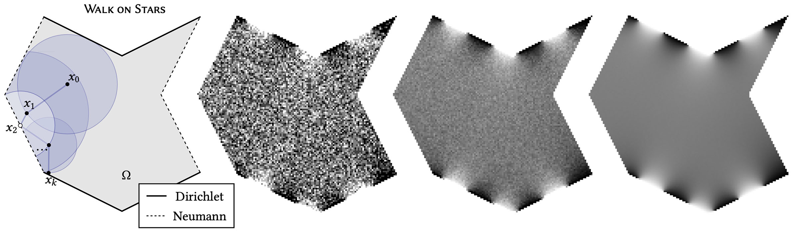

# wost-simple

This repository provides basic example code and a step-by-step tutorial on how to implement the [_walk on stars (WoSt)_ algorithm](https://www.cs.cmu.edu/~kmcrane/Projects/WalkOnStars/index.html), introduced in the paper

> Sawhney, Miller, Gkioulekas, Crane  
> _Walk on Stars: A Grid-Free Monte Carlo Method for PDEs with Neumann Boundary Conditions_  
> **ACM Transactions on Graphics (2023)**

WoSt is a grid-free Monte Carlo method for solving basic partial differential equations (PDEs) like the Laplace or Poisson equation, with both Dirichlet and Neumann boundary conditions.  Unlike finite element, boundary element, or finite difference methods it does not require a volumetric grid or mesh, nor a high-quality boundary mesh.  Instead, it uses random walks to solve the problem directly on the original boundary representation; moreover, it can provide accurate solution values at a single query point, rather than needing to solve the problem over the entire domain.

Though the derivation of algorithm takes some work, the final algorithm remains about as simple as the original _walk on spheres (WoS)_ method of [Muller (1956)](https://doi.org/10.1214%2Faoms%2F1177728169).  For a Laplace equation with Dirichlet boundary conditions, WoS essentially says:

> **(Walk on Spheres)** _Repeatedly jump to a random point on a **sphere** around the current point until you reach the boundary.  The average boundary value over many such walks yields the solution._

For a Laplace equation with Dirichlet and zero-Neumann boundary conditions, WoSt is nearly identical:

> **(Walk on Stars)** _Repeatedly jump to a random point on a **star-shaped region** around the current point until you reach the **Dirichlet** boundary.  The average boundary value over many such walks yields the solution._

The main implementation effort is in enriching the closest point queries used by WoS with _closest silhouette point queries_, as well as standard "first hit" ray intersection queries.  A complete 2D implementation with no external dependencies is provided here in about 150 lines of C++ code (ignoring I/O), in the file [WoStLaplace.cpp](code/WoStLaplace.cpp).  For simplicity, we omit nonzero Neumann conditions and acceleration of geometric queries—a full 3D implementation is discussed in [Sawhney et al (2023)](https://www.cs.cmu.edu/~kmcrane/Projects/WalkOnStars/index.html).

To emphasize the core ideas of the WoSt algorithm, this tutorial focuses on a bare-bones 2D version of WoSt that solves the Laplace equation

$$
   \begin{array}{rcll}
      \Delta u &=& 0 & \text{on}\ \Omega, \\
             u &=& g & \text{on}\ \partial\Omega_D, \\
             \tfrac{\partial u}{\partial n} &=& 0 & \text{on}\ \partial\Omega_N, \\
   \end{array}
$$

where $\Omega \subset \mathbb{R}^2$ is a closed polygon in the plane, $g$ is a real-valued function on the Dirichlet part of the boundary $\partial\Omega_D$, and $\partial\Omega_N$ is the complementary Neumann part of the boundary.  

#### Acknowledgements

All diagrams in this document were made using [Penrose](https://github.com/penrose/penrose).  Special thanks to Wode Ni (@wodeni), Sam Estep (@samestep), Yiliang Liang (@liangyiliang), and the rest of the Penrose team for development support during production of this document.

## License

<a property="dct:title" rel="cc:attributionURL" href="https://github.com/GeometryCollective/wost-simple">Walk on Stars (Implementation Guide)</a> by <a xmlns:cc="http://creativecommons.org/ns#" href="http://rohansawhney.io/" property="cc:attributionName" rel="cc:attributionURL">Rohan Sawhney</a>, 
<a xmlns:cc="http://creativecommons.org/ns#" href="https://www.bailey-miller.com/" property="cc:attributionName" rel="cc:attributionURL">Bailey Miller</a>, 
<a xmlns:cc="http://creativecommons.org/ns#" href="https://www.cs.cmu.edu/~igkioule/" property="cc:attributionName" rel="cc:attributionURL">Ioannis Gkioulekas</a>, and
<a xmlns:cc="http://creativecommons.org/ns#" href="http://www.cs.cmu.edu/~kmcrane/" property="cc:attributionName" rel="cc:attributionURL">Keenan Crane</a> is licensed under <a href="http://creativecommons.org/licenses/by/4.0/?ref=chooser-v1" target="_blank" rel="license noopener noreferrer" style="display:inline-block;">CC BY 4.0.

Code is released under an [MIT License](LICENSE).

